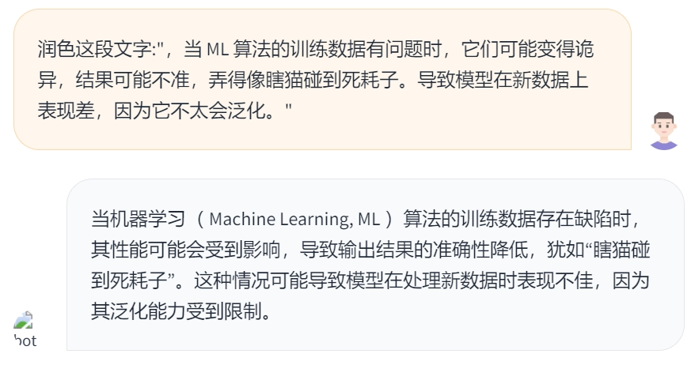
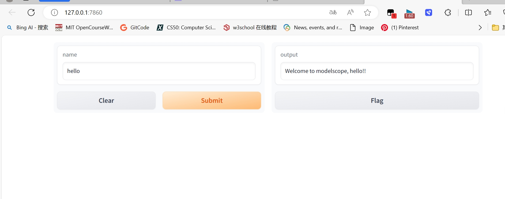

### Agent模型原理

   **Agent可以理解为在某种能自主理解、规划决策、执行复杂任务的智能体**，可以将其定义为LLM + memory + planning skills + tool use，即大语言模型、记忆、任务规划、工具使用的集合.


### 环境搭建

使用虚拟环境开发qwen-agent，配置环境详细可以看[这篇博客](https://tianchi.aliyun.com/forum/post/641455)。本篇笔记会探讨更多环境搭建的细节。

**总体环境搭建的流程如下：**

clone agent项目 -> 安装依赖(`pip install -r requirement.txt`) ->  移动`apps/agentfabric`文件夹至根目录 -> 运行`app.py`

```python
git clone https://github.com/modelscope/modelscope-agent.git
cd modelscope-agent  && pip install -r requirements.txt
 && pip install -r demo/agentfabric/requirements.txt
```

**注意**此处要install两个项目的requirement.txt文件。

由于实际生产中，使用到大模型需要api的支持，因此我们需要设置**api环境变量**

1. **设置环境变量**，如果是modelscope的notebook，你可以在创空间内部设置apikey，如果是其他的云端环境，你可以在终端中运行`export MODELSCOPE_API_TOKEN=your-api-key`的方式来临时添加环境变量。
   
   - `MODELSCOPE_API_TOKEN`中填上你的ModelScore SDK令牌，快速获取[地址](https://www.modelscope.cn/my/myaccesstoken)
   
   - 在`DASHSCOPE_API_KEY`中填上你的灵积api，[[阿里云登录 - 欢迎登录阿里云，安全稳定的云计算服务平台](https://dashscope.console.aliyun.com/apiKey)]

  2.**移动config文件夹中的配置文件**，需要注意`apps/agentfaric`与`modelscope-agent`文件夹中都有config文件夹，我们需要把他们合并在一起

### Agent构建

我构建了**一个简单的科研论文润色小助手**。

#### agent 介绍

这是一个专为科研人员设计的论文润色助手，能够以大模型的专业知识来补充用户输入的文字，修正用户语言的语病，逻辑错误，并提供中英双语的论文版本。

#### agent 设置

能够理解并回应用户的指令；；根据用户的需求对论文进行专业级别的润色和修改，包括但不限于语法修正、句子通顺度优化、用语精准和专业；；修正用户语言的语病和逻辑错误；；自动识别用户输入的语言，并生成中英双语版本；

#### agent 能力:

作为一个科研论文润色小助手，首先提供的服务应该是文字上的润色服务，以及翻译服务，所以并没有用到第三方的一些工具如同,`code interpreter`,`img_gen`，但是在未来的开发中，我们可以**尝试联网功能**，来为该小助手提供更多关于论文修改补充的建议，可供参考的材料等。

通过与构建Agent的不断对话，确定agent的logo,基本功能。同时根据配置页agent的详细设定对agent进行进一步的微调，我们可以看到如下的使用效果:



#### gradio简介

    qwen agent的官方demo由gradio实现，因此我们在本地或者云端部署agent时，也应该了解一些gradio的简单知识:

    radio是一个用于简化机器学习模型部署的Python库。它的目标是让用户可以轻松地构建交互性的界面，用于与机器学习模型进行交互，而无需深入了解前端和部署的复杂性。

    使用实例

```python
import gradio as gr
def modelscope_quickstart(name):
    return "Welcome to modelscope, " + name + "!!"
demo = gr.Interface(fn=modelscope_quickstart, inputs="text", outputs="text")
demo.launch()
```

在这个例子中，`inputs="text"`表示输入是文本，`outputs="text"`表示输出也是文本,`fn`接收输入，同时输出预测后的结果。

结果展示:



#### agent 源码分析

函数中

```python
class YourClass:
    def _remote_call(self, *args, **kwargs):
        # args 是一个元组，包含所有传递的位置参数
        print("Positional arguments:", args)

        # kwargs 是一个字典，包含所有传递的关键字参数
        print("Keyword arguments:", kwargs)

# 创建类实例
instance = YourClass()
# 调用 _remote_call 函数并传递参数
instance._remote_call(1, 2, 3, name="John", age=25)
```

定义的tool工具，可以为Agent所用。

```python
class AliyunRenewInstanceTool(Tool):

    description = '续费一台包年包月ECS实例'
    name = 'RenewInstance'
    parameters: list = [{
        'name': 'instance_id',
        'description': 'ECS实例ID',
        'required': True
    },
    {
        'name': 'period',
        'description': '续费时长以月为单位',
        'required': True
    }
    ]

    def __call__(self, remote=False, *args, **kwargs):
        if self.is_remote_tool or remote:
            return self._remote_call(*args, **kwargs)
        else:
            return self._local_call(*args, **kwargs)

    def _remote_call(self, *args, **kwargs):
        pass

    def _local_call(self, *args, **kwargs):
        instance_id = kwargs['instance_id']
        period = kwargs['period']
        return {'result': f'已完成ECS实例ID为{instance_id}的续费，续费时长{period}月'}
```

#### 参考资料:

[GitHub - datawhalechina/agent-tutorial](https://github.com/datawhalechina/agent-tutorial)[GitHub - datawhalechina/agent-tutorial](https://github.com/datawhalechina/agent-tutorial)
