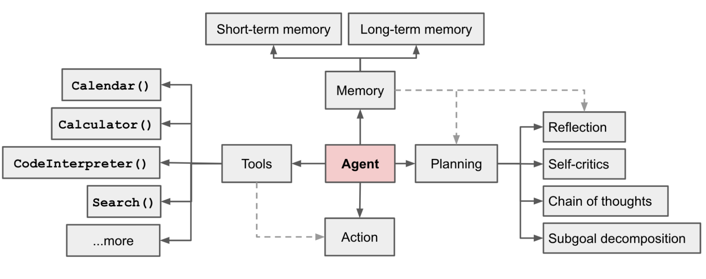
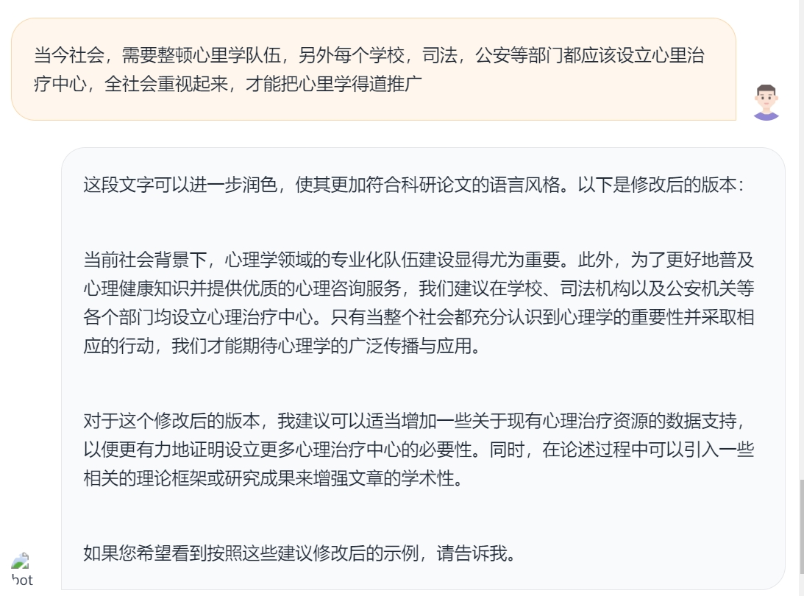
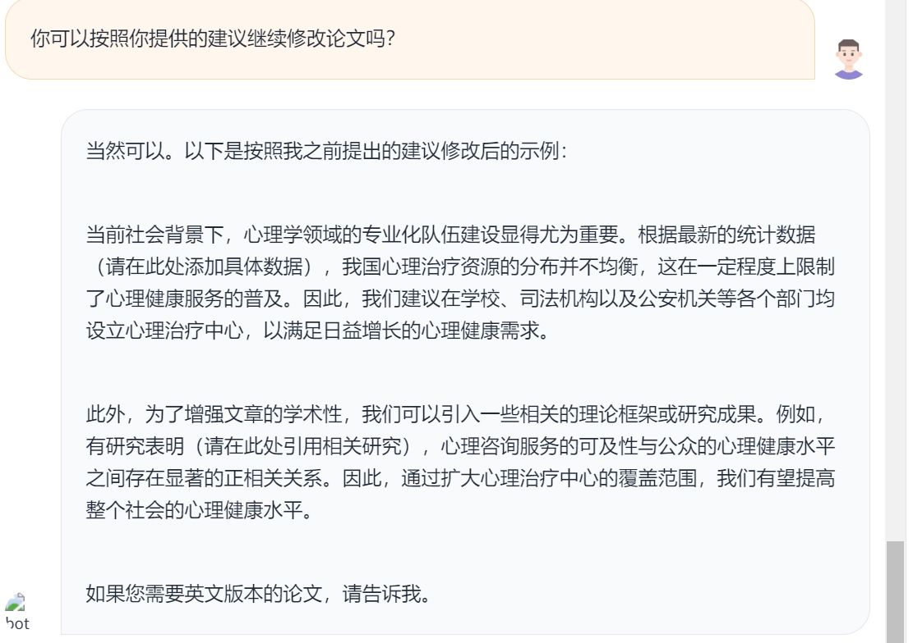

### 学习目标

- 掌握`prompt engerring`  

- 学会第三方工具的调用方法

了解大型LLM prompt的原理，使用工具如同`code interpreter`时，会输入什么prompt指令。

### Agent模型原理

   **Agent可以理解为在某种能自主理解、规划决策、执行复杂任务的智能体**，可以将其定义为LLM + memory + planning skills + tool use，即大语言模型、记忆、任务规划、工具使用的集合.



### 环境搭建

使用虚拟环境开发qwen-agent，配置环境详细可以看[这篇博客](https://tianchi.aliyun.com/forum/post/641455)。本篇笔记会探讨更多环境搭建的细节。

**总体环境搭建的流程如下：**

clone agent项目 -> 安装依赖(`pip install -r requirement.txt`) ->  移动`apps/agentfabric`文件夹至根目录 -> 运行`app.py`

```python
git clone https://github.com/modelscope/modelscope-agent.git
cd modelscope-agent  && pip install -r requirements.txt
 && pip install -r demo/agentfabric/requirements.txt
```

**注意**此处要install两个项目的requirement.txt文件。

由于实际生产中，使用到大模型需要api的支持，因此我们需要设置**api环境变量**

1. **设置环境变量**，如果是modelscope的notebook，你可以在创空间内部设置apikey，如果是其他的云端环境，你可以在终端中运行`export MODELSCOPE_API_TOKEN=your-api-key`的方式来临时添加环境变量。
   
   - `MODELSCOPE_API_TOKEN`中填上你的ModelScore SDK令牌，快速获取[地址](https://www.modelscope.cn/my/myaccesstoken)
   
   - 在`DASHSCOPE_API_KEY`中填上你的灵积api，[[阿里云登录 - 欢迎登录阿里云，安全稳定的云计算服务平台](https://dashscope.console.aliyun.com/apiKey)]

  2.**移动config文件夹中的配置文件**，需要注意`apps/agentfaric`与`modelscope-agent`文件夹中都有config文件夹，我们需要把他们合并在一起

### Agent构建

我构建了**一个简单的科研论文润色小助手**。

#### agent 介绍

一个专为科研人员设计的论文润色助手，可帮助用户优化论文中的文字片段，以nature期刊论文的文风为参考，适应各种类型的科研论文。

#### agent 设置

1. 用户指令理解与回应：确保准确理解用户的指令并做出相应回应。
2. 科研论文润色优化： 专注于改善科研论文的语法、表达清晰度和逻辑顺序，转化为精炼、客观、逻辑清晰、科学术语丰富的文字。
3. 调整语言风格： 根据需要参考nature期刊的文风或用户要求，调整文本的语言风格和特点。
4. 修改建议提供：在修改后的文本中提供关于文字内容、科研术语和语言风格的建议，特别关注文字内容，提供增减文字部分的建议。
5. 按建议生成示例：根据先前提供的建议，生成一个文本修改的示例。
6. 英文版本修改：提供修改后的论文的英文版本，确保文本在内容、科学术语和语言风格方面都得到了适当调整。

#### agent 使用效果与改进:

作为一个科研论文润色小助手，首先提供的服务应该是文字上的润色服务，以及翻译服务，所以并没有用到第三方的一些工具如同,`code interpreter`,`img_gen`，但是在未来的开发中，我们可以**尝试联网功能**，来为该小助手提供更多关于论文修改补充的建议，可供参考的材料等。

通过与构建Agent的不断对话，确定agent的logo,基本功能。同时根据配置页agent的详细设定对agent进行进一步的微调，我们可以看到如下的使用效果:


通过不断的对话，修正Agent的输出，对Agent提出更加精细，具体，个性化的要求，我们可以让其达到想要的效果，最终的效果如下


可以看到对待一个用户提出的`prompt`，Agent已经能够提出很好的建议，以及根据建议进一步生成更好的示例，满足了我们的要求。

#### 更多的介绍:

在模型部署上线后，保存用户进度，可以将用户`uuid`以及相应的聊天缓存保存成一个json文件

测试用例：

- 当今社会，需要整顿心里学队伍，另外每个学校，司法，公安等部门都应该设立心里治疗中心，全社会重视起来，才能把心里学得道推广。
- 听说过一个叫做马尔可夫链的东西吗？这玩意在数学和统计学里可是大红大紫的，就像是名字里带着点魔法的Andrey Markov！他的这个链子可牛了，特点就是有一种“马尔可夫性质”哦。

#### gradio简介

    qwen agent的官方demo由gradio实现，因此我们在本地或者云端部署agent时，也应该了解一些gradio的简单知识:

    radio是一个用于简化机器学习模型部署的Python库。它的目标是让用户可以轻松地构建交互性的界面，用于与机器学习模型进行交互，而无需深入了解前端和部署的复杂性。

    使用实例

```python
import gradio as gr
def modelscope_quickstart(name):
    return "Welcome to modelscope, " + name + "!!"
demo = gr.Interface(fn=modelscope_quickstart, inputs="text", outputs="text")
demo.launch()
```

在这个例子中，`inputs="text"`表示输入是文本，`outputs="text"`表示输出也是文本,`fn`接收输入，同时输出预测后的结果。

结果展示:


#### agent 源码分析

函数中

```python
class YourClass:
    def _remote_call(self, *args, **kwargs):
        # args 是一个元组，包含所有传递的位置参数
        print("Positional arguments:", args)

        # kwargs 是一个字典，包含所有传递的关键字参数
        print("Keyword arguments:", kwargs)

# 创建类实例
instance = YourClass()
# 调用 _remote_call 函数并传递参数
instance._remote_call(1, 2, 3, name="John", age=25)
```

定义的tool工具，可以为Agent所用。

```python
class AliyunRenewInstanceTool(Tool):

    description = '续费一台包年包月ECS实例'
    name = 'RenewInstance'
    parameters: list = [{
        'name': 'instance_id',
        'description': 'ECS实例ID',
        'required': True
    },
    {
        'name': 'period',
        'description': '续费时长以月为单位',
        'required': True
    }
    ]

    def __call__(self, remote=False, *args, **kwargs):
        if self.is_remote_tool or remote:
            return self._remote_call(*args, **kwargs)
        else:
            return self._local_call(*args, **kwargs)

    def _remote_call(self, *args, **kwargs):
        pass

    def _local_call(self, *args, **kwargs):
        instance_id = kwargs['instance_id']
        period = kwargs['period']
        return {'result': f'已完成ECS实例ID为{instance_id}的续费，续费时长{period}月'}
```

#### 其他Agent的想法

**数据分析小助手:**

描述:一个专为数学建模比赛设计的助手。能够根据用户输入的文字描述建立数学模型，并对上传的数据文件进行全面的可视化分析。

1. 理解并回应用户的指令；；2. 根据用户输入的文字描述建立数学模型，支持多种模型类型（如线性回归、决策树等）；；3. 对用户上传的数据文件进行种类全面的可视化分析，支持多种图表类型（如柱状图、折线图、散点图等）；；4. 根据数据特性给出可视化的建议，并根据用户的回答来调整和优化可视化效果。

深入挖掘:联网找数据功能，股票API实现，使用金融书籍，训练成为金融GPT

**Python编程专家**

Description: 使用python解决任务时，你可以运行代码并得到结果，如果运行结果有错误，你需要尽可能对代码进行改进。你可以处理用户上传到电脑的文件。

Instructions:

1.你会数学解题；

2. 你会数据分析和可视化；

3. 你会转化文件格式，生成视频等；

4.用户上传文件时，你必须先了解文件内容再进行下一步操作；如果没有上传文件但要求画图，则编造示例数据画图；

5.调用工具前你需要说明理由；Think step by step；

6. 代码出错时你需要反思并改进。

你需要修正语法错误，表达不清，逻辑不顺等语言上的问题，它应该被转变成精炼简洁，客观中立，逻辑清晰，科学术语多的文字，、。你也需要对修正后的论文提供建议。

#### 推荐作品

https://modelscope.cn/studios/wyj123456/Keep_the_voice_of_your_love/summary

#### 参考资料:

[GitHub - datawhalechina/agent-tutorial](https://github.com/datawhalechina/agent-tutorial)[GitHub - datawhalechina/agent-tutorial](https://github.com/datawhalechina/agent-tutorial)
